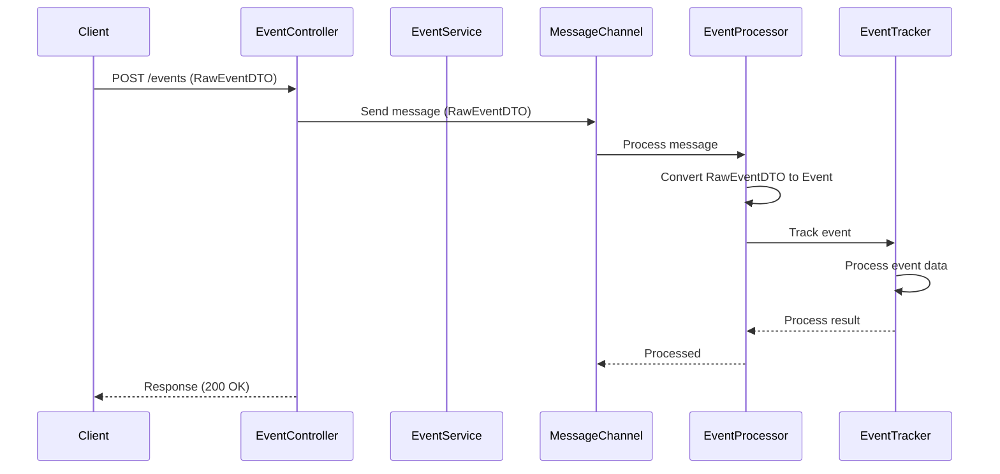
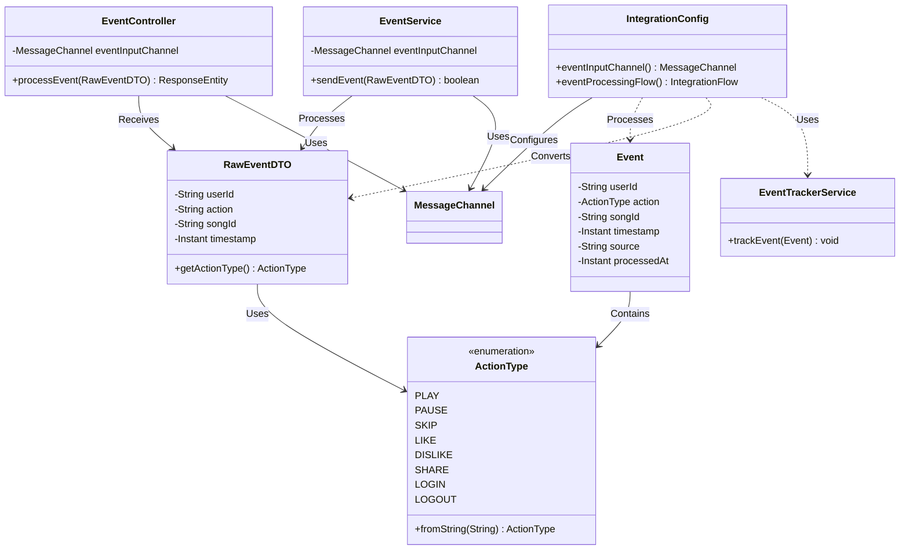

# 🎧 Event Processing System – Requirements & Design Plan

## 📌 Project Overview

This project aims to build a modular and scalable **User Activity Event Processing System** for a music streaming platform. It processes real-time user behavior events such as "play", "pause", "like", and "skip", and routes them to appropriate downstream systems (analytics, recommendations, storage, etc.).

## ✅ Goals

- Handle user events from RESTful requests.
- Normalize and enrich events into a standard structure.
- Filter out irrelevant or duplicated events.
- Route events dynamically based on type or content.
- Integrate with external services (e.g., recommendation system, database).
- Keep the system modular, testable, and extensible.

## 🏗️ Tech Stack

| Layer            | Technology                      |
|------------------|----------------------------------|
| Language         | Java 17+                         |
| Framework        | Spring Boot, Spring Integration |
| Messaging        | Kafka (optional for async)      |
| Storage          | PostgreSQL / MongoDB            |
| Monitoring       | JMX, Spring Actuator            |
| Testing          | JUnit 5, Testcontainers          |

## 📥 Event Flow Design

```
    +------------------------+
    | HTTP REST Endpoint     |
    | (/events POST)         |
    +-----------+------------+
                |
                v
     +----------+------------+
     | Message Transformer   | <- normalize event format
     +----------+------------+
                |
                v
     +----------+------------+
     | Message Filter        | <- remove duplicates, bots
     +----------+------------+
                |
                v
     +----------+------------+
     | Message Router        | <- route to analytics, storage, AI
     +----+----------+-------+
          |          |
 +--------+--+   +---+--------+
 | Analytics  |   | AI Engine |
 | Service    |   | Gateway   |
 +------------+   +-----------+

```

## 📊 Sequence Diagram

The following sequence diagram shows the event processing flow:



## 📚 Class Diagram

The following class diagram shows the main components and their relationships:



## 📦 Example Event Payload (Raw Input)

```json
{
  "userId": "u123",
  "action": "like",
  "songId": "s456",
  "timestamp": null
}
```

## 🧰 Standardized Event Format (After Transformation)
```json
{
  "userId": "u123",
  "action": "LIKE",
  "songId": "s456",
  "timestamp": "2025-03-29T10:23:45Z",
  "source": "MOBILE",
  "processedAt": "2025-03-29T10:23:46Z"
}
```

## 📝 Note

1. In GitHub, these diagrams will be rendered automatically
2. In VS Code, install the "Markdown Preview Mermaid Support" extension
3. You can also use the online Mermaid editor: [Mermaid Live Editor](https://mermaid.live/)
