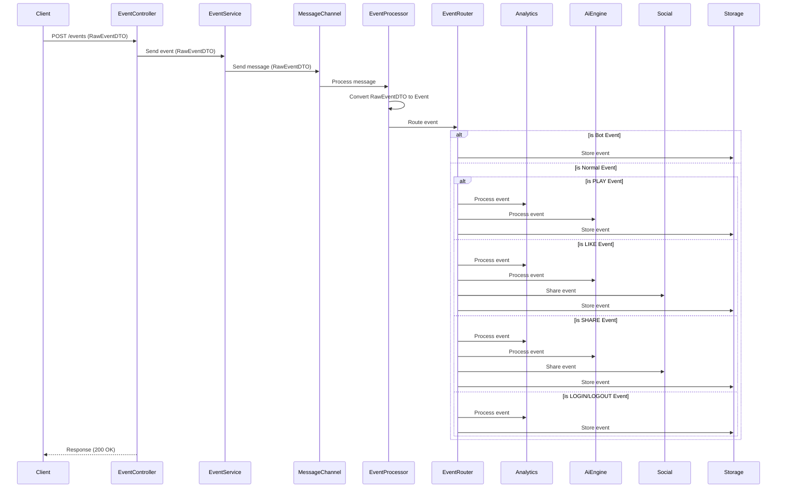
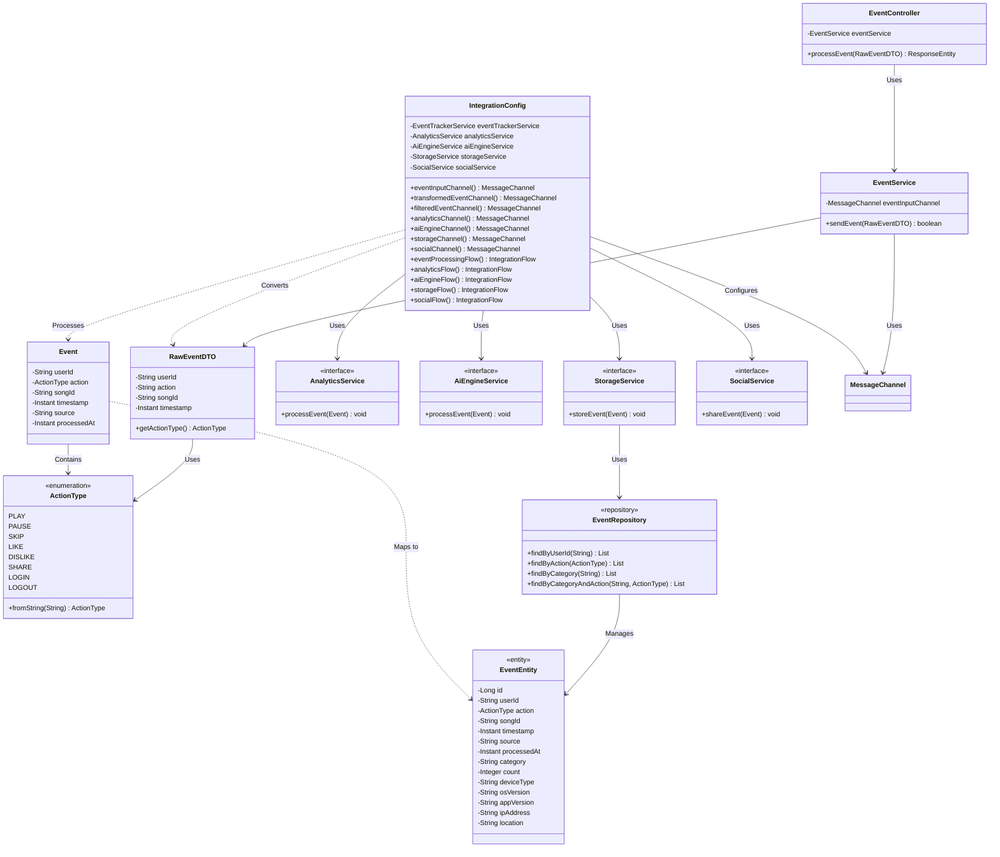

# 🎧 Event Processing System – Requirements & Design Plan

## 📌 Project Overview

This project aims to build a modular and scalable **User Activity Event Processing System** for a music streaming platform. It processes real-time user behavior events such as "play", "pause", "like", and "skip", and routes them to appropriate downstream systems (analytics, recommendations, storage, etc.).

## ✅ Goals

- Handle user events from RESTful requests.
- Normalize and enrich events into a standard structure.
- Filter out irrelevant or duplicated events.
- Route events dynamically based on type or content.
- Integrate with external services (e.g., recommendation system, database).
- Keep the system modular, testable, and extensible.

## 🏗️ Tech Stack

| Layer            | Technology                      |
|------------------|----------------------------------|
| Language         | Java 17+                         |
| Framework        | Spring Boot, Spring Integration |
| Messaging        | Kafka (optional for async)      |
| Storage          | SQL Server                      |
| Database Access  | Spring Data JPA, Flyway         |
| Monitoring       | JMX, Spring Actuator            |
| Testing          | JUnit 5, Testcontainers          |

## 📥 Event Flow Design

```
    +------------------------+
    | HTTP REST Endpoint     |
    | (/events POST)         |
    +-----------+------------+
                |
                v
     +----------+------------+
     | Message Transformer   | <- normalize event format
     +----------+------------+
                |
                v
     +----------+------------+
     | Message Filter        | <- filter invalid events
     +----------+------------+
                |
                v
     +----------+------------+       +---------------------+
     | Message Router        | ----> | Bot Event Handler   |
     +----+-------+-----+----+       | (Storage only)      |
          |       |     |            +---------------------+
          |       |     |
 +--------+--+   ++-----------+   +-----------+
 | Analytics  |   | AI Engine |   | Social    |
 | Service    |   | Gateway   |   | Media     |
 +------------+   +-----------+   +-----------+
          |       |     |
          +-------+-----+
                |
                v
     +----------+------------+
     | Storage Service       | <- persists events to SQL Server
     +------------------------+
                |
                v
     +----------+------------+
     | SQL Server Database   |
     +------------------------+

```

## 📊 Sequence Diagram

The following sequence diagram shows the event processing flow:



## 📚 Class Diagram

The following class diagram shows the main components and their relationships:



## 🔄 Event Routing Logic

The system routes events based on several factors:

1. **Event Validation**: Events must have a non-empty userId, valid action type, and a songId (except for LOGIN/LOGOUT events)
2. **Bot Event Handling**: Events from bot users (userId starting with "bot_") are only sent to Storage service
3. **Standard Event Routing**:
   - **PLAY**: Analytics, AI Engine, Storage
   - **PAUSE/SKIP**: Analytics, Storage
   - **LIKE/DISLIKE**: Analytics, AI Engine, Social, Storage
   - **SHARE**: Analytics, AI Engine, Social, Storage
   - **LOGIN/LOGOUT**: Analytics, Storage

## 📦 Example Event Payload (Raw Input)

```json
{
  "userId": "u123",
  "action": "like",
  "songId": "s456",
  "timestamp": null
}
```

## 🧰 Standardized Event Format (After Transformation)
```json
{
  "userId": "u123",
  "action": "LIKE",
  "songId": "s456",
  "timestamp": "2025-03-29T10:23:45Z",
  "source": "MOBILE",
  "processedAt": "2025-03-29T10:23:46Z"
}
```

## 📊 Database Design

### Database Table Structure

The system uses SQL Server as the database for event storage. The events table is designed as follows:

```sql
CREATE TABLE events (
    id BIGINT IDENTITY(1,1) PRIMARY KEY,
    user_id NVARCHAR(255),
    action NVARCHAR(50) NOT NULL,
    song_id NVARCHAR(255),
    timestamp DATETIMEOFFSET,
    source NVARCHAR(255),
    processed_at DATETIMEOFFSET,
    category NVARCHAR(50) NOT NULL,
    count INT NOT NULL DEFAULT 0,
    device_type NVARCHAR(50),
    os_version NVARCHAR(50),
    app_version NVARCHAR(50),
    ip_address NVARCHAR(50),
    location NVARCHAR(255)
);

-- Index design
CREATE INDEX idx_events_category_action ON events(category, action);
CREATE INDEX idx_events_user_id ON events(user_id);
CREATE INDEX idx_events_timestamp ON events(timestamp);
CREATE INDEX idx_events_location ON events(location);
```

### Entity Class Design

To support database storage functionality, the system includes the following core classes:

1. **EventEntity**: Entity class corresponding to the database table
   ```java
   @Entity
   @Table(name = "events")
   public class EventEntity {
       @Id
       @GeneratedValue(strategy = GenerationType.IDENTITY)
       private Long id;
       
       @Column(name = "user_id")
       private String userId;
       
       @Column(name = "action", nullable = false)
       @Enumerated(EnumType.STRING)
       private ActionType action;
       
       @Column(name = "song_id")
       private String songId;
       
       @Column(name = "timestamp")
       private Instant timestamp;
       
       @Column(name = "source")
       private String source;
       
       @Column(name = "processed_at")
       private Instant processedAt;
       
       @Column(name = "category", nullable = false)
       private String category;
       
       @Column(name = "count", nullable = false)
       private Integer count;
       
       // Extended metadata fields
       @Column(name = "device_type")
       private String deviceType;
       
       @Column(name = "os_version")
       private String osVersion;
       
       @Column(name = "app_version")
       private String appVersion;
       
       @Column(name = "ip_address")
       private String ipAddress;
       
       @Column(name = "location")
       private String location;
   }
   ```

2. **EventRepository**: Interface providing database access functionality
   ```java
   @Repository
   public interface EventRepository extends JpaRepository<EventEntity, Long> {
       List<EventEntity> findByUserId(String userId);
       List<EventEntity> findByAction(ActionType action);
       List<EventEntity> findByCategory(String category);
       List<EventEntity> findByCategoryAndAction(String category, ActionType action);
   }
   ```

3. **StorageServiceImpl**: Implementation of event storage logic
   ```java
   @Service
   public class StorageServiceImpl implements StorageService {
       private final EventRepository eventRepository;
       
       @Override
       public void storeEvent(Event event) {
           EventEntity eventEntity = EventEntity.builder()
               .userId(event.getUserId())
               .action(event.getAction())
               .songId(event.getSongId())
               .timestamp(event.getTimestamp())
               .source(event.getSource())
               .processedAt(event.getProcessedAt())
               .category(event.getAction() != null ? event.getAction().name() : "UNKNOWN")
               .count(1)
               .build();
           
           eventRepository.save(eventEntity);
       }
   }
   ```

### Database Features

The implemented database features include:

1. **Complete Event Recording**: The system stores all validated events in the database, preserving a complete history of user interactions.
2. **Event Categorization**: Each event is categorized by action type (PLAY, LIKE, SHARE, etc.), facilitating subsequent analysis.
3. **User Behavior Analysis**: Provides functionality to query events by user ID, supporting user behavior analysis.
4. **Performance Optimization**: Improves query efficiency through index design, supporting high-concurrency access.
5. **Metadata Extension**: Supports storage of extended information such as device type, operating system version, application version, IP address, and location.

### Migration Management

The system uses Flyway for database migration management, ensuring that the database schema can evolve continuously with application iterations:

1. **V1__Create_Events_Table.sql**: Creates the events table and basic indexes.
2. **V2__Add_Event_Metadata.sql**: Extends the events table, adding device and location-related fields.

## 🔐 Database Security and Configuration

To maintain security and adhere to best practices, we've implemented the following approach for database credentials:

### Environment Variables for Production

In production environments, database credentials are sourced from environment variables:

```properties
# Database Configuration
SPRING_DATASOURCE_URL=jdbc:sqlserver://your-server:1433;database=your-db
SPRING_DATASOURCE_USERNAME=your-username
SPRING_DATASOURCE_PASSWORD=your-password

# Flyway Configuration
FLYWAY_URL=jdbc:sqlserver://your-server:1433;database=your-db
FLYWAY_USER=your-username
FLYWAY_PASSWORD=your-password
```

### Local Development Setup

For local development, we use a separate properties file that is excluded from version control:

1. Create a copy of `.env.template` as `.env` with your local database credentials
2. Or use the `application-local.properties` file

```properties
# Local Development Database Configuration
spring.datasource.url=jdbc:sqlserver://localhost:1433;database=eventdb
spring.datasource.username=sa
spring.datasource.password=YourPassword
```

### Configuration Files

- `application.properties`: Main configuration file with environment variable placeholders
- `application-local.properties`: Local development settings (git-ignored)
- `application-prod.properties`: Production-specific settings
- `.env.template`: Template for environment variables

### Setup Instructions

1. For local development:
   ```bash
   cp .env.template .env
   # Edit .env with your database credentials
   ```
   
   Use application-local.properties for local development:
   
   a. Create application-local.properties file in src/main/resources directory:
   ```bash
   touch src/main/resources/application-local.properties
   ```
   
   b. Add local environment configuration to the file (ensure the file is added to .gitignore):
   ```properties
   # Local Database Configuration
   spring.datasource.url=jdbc:sqlserver://localhost:1433;databaseName=eventdb;trustServerCertificate=true
   spring.datasource.username=sa
   spring.datasource.password=YourStrong@Passw0rd
   
   # Flyway Configuration
   spring.flyway.enabled=true
   spring.flyway.baseline-on-migrate=true
   
   # Logging Configuration
   logging.level.root=INFO
   logging.level.com.example.demo=DEBUG
   
   # Server Configuration
   server.port=8080
   ```
   
   c. Use local configuration file to run the application:
   ```bash
   # use Maven
   mvn spring-boot:run -Dspring-boot.run.profiles=local
   
   # or directly use Java
   java -jar target/demo.jar --spring.profiles.active=local
   
   # use IDE
   # add -Dspring.profiles.active=local as VM parameter in run configuration
   ```
   
   d. Access the application:
   ```
   http://localhost:8080
   ```

2. For production deployment:
   ```bash
   # Set environment variables on your server/container
   export SPRING_DATASOURCE_URL=jdbc:sqlserver://...
   export SPRING_DATASOURCE_USERNAME=your-username
   export SPRING_DATASOURCE_PASSWORD=your-password
   
   # Run the application with production profile
   java -jar demo.jar --spring.profiles.active=prod
   ```

## 📝 Note

1. In GitHub, these diagrams will be rendered automatically
2. In VS Code, install the "Markdown Preview Mermaid Support" extension
3. You can also use the online Mermaid editor: [Mermaid Live Editor](https://mermaid.live/)
